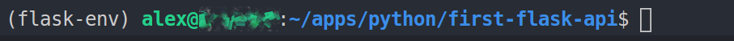
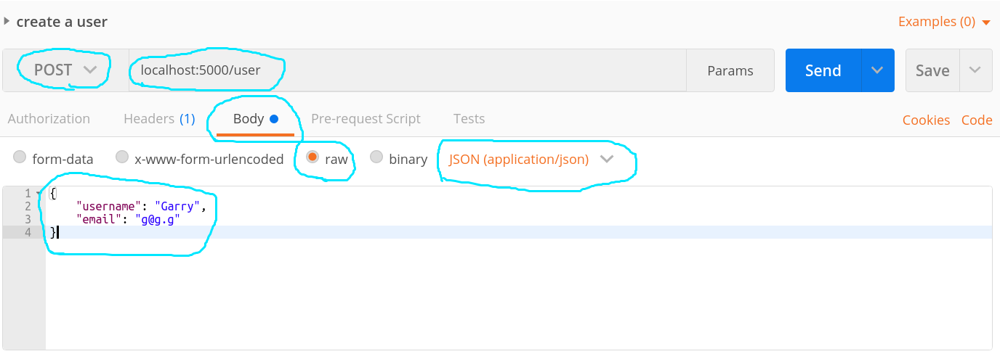

# Simple python flask API

## Install flask

Use a virtual environment for the app so that it can maintain its own libraries
without worrying about versions.

### Prerequisites

* `sudo apt install python3-venv`
* python installed

### Walkthrough 
<small>(Record of the steps I took)</small>

1. Make a new virtual environment in a directory called flask-env:<br>
    `python3 -m venv flask-env`

1. Activate the environment:<br>
    `chmod u+x flask-env/bin/activate`<br>
    `source flask-env/bin/activate`
1. `pip install Flask`
    * This gave a red warning output: <br>`Failed building wheel for MarkupSafe`
    * This gave a warning output: <br>`You are using pip version 8.1.1, however 
        version 10.0.0 is available.`<br>`You should consider upgrading via 
        the 'pip install --upgrade pip' command.`
1. `pip install --upgrade pip`
1. Wasting a lot of time trying to investigate this Failed building wheel for 
MarkupSafe issue.. the main parts of the error output are:<br>
`Running setup.py bdist_wheel for itsdangerous ... error`<br>
&vellip;<br>
`error: invalid command 'bdist_wheel'`<br>
&vellip;<br>
`Failed building wheel for itsdangerous`<br>
&vellip;<br>
`Running setup.py bdist_wheel for MarkupSafe ... error`<br>
&vellip;<br>
`error: invalid command 'bdist_wheel'`<br>
&vellip;<br>
`Failed building wheel for MarkupSafe`

    Looks like a 
    [possible solution](https://stackoverflow.com/questions/34819221/why-is-python-setup-py-saying-invalid-command-bdist-wheel-on-travis-ci) 
    is to just run:<br>
    `pip install wheel`

    Now running:<br>
    `pip uninstall Flask`<br>
    `pip install Flask`<br>

    But that seemed to complete way too quickly, as if it didn&rsquo;t retry 
    all the things it did the first time.

    going to try doing the same for the packages that produced the errors 
    originally:<br>

    `pip uninstall Flask`<br>
    `pip uninstall itsdangerous`<br>
    `pip uninstall MarkupSafe`<br>
    `pip install MarkupSafe`<br>
    `pip install itsdangerous`<br>
    `pip install Flask`<br>

    Ok going to assume that is sorted out now and continue on&hellip;

1. Created a file `index.py` to be the main server app with following code:

    ```python
    from flask import Flask

    app = Flask(__name__)

    @app.route("/")
    def hello():
    return "hello world"

    if __name__ == '__main__':
        app.run(debug=True)
    ```
1. Executing `python index.py` in the terminal and then visit localhost:5000 in
    the browser

1. The line `@app.route("/")` just above the hello function is a python function
    decorator, basically it means that flask's route("/") function is being
    called and is also being passed our hello function. 
    [Link to more on decorators](https://www.python.org/dev/peps/pep-0318/)

1. Now to see an example of a CRUD app done in Flask<br>
    The following was taken from the tutorial:<br>
    https://medium.com/python-pandemonium/build-simple-restful-api-with-python-and-flask-part-2-724ebf04d12

1. The following code is the CRUD app that only handles one type, users, save it as `crud.py`:<br>
    
    ```python
    from flask import Flask, request, jsonify
    from flask_sqlalchemy import SQLAlchemy
    from flask_marshmallow import Marshmallow
    import os

    app = Flask(__name__)
    basedir = os.path.abspath(os.path.dirname(__file__))
    app.config['SQLALCHEMY_DATABASE_URI'] = 'sqlite:///' + os.path.join(basedir, 'crud.sqlite')
    db = SQLAlchemy(app)
    ma = Marshmallow(app)


    class User(db.Model):
        id = db.Column(db.Integer, primary_key=True)
        username = db.Column(db.String(80), unique=True)
        email = db.Column(db.String(120), unique=True)

        def __init__(self, username, email):
            self.username = username
            self.email = email


    class UserSchema(ma.Schema):
        class Meta:
            # Fields to expose, normally you wouldn't reveal the id
            fields = ('username', 'email', 'id')


    user_schema = UserSchema()
    users_schema = UserSchema(many=True)


    # endpoint to create new user
    @app.route("/user", methods=["POST"])
    def add_user():
        username = request.json['username']
        email = request.json['email']
        
        new_user = User(username, email)
        db.session.add(new_user)
        db.session.commit()
        return user_schema.jsonify(new_user)


    # endpoint to show all users
    @app.route("/user", methods=["GET"])
    def get_user():
        all_users = User.query.all()
        result = users_schema.dump(all_users)
        return jsonify(result.data)


    # endpoint to get user detail by id
    @app.route("/user/<id>", methods=["GET"])
    def user_detail(id):
        user = User.query.get(id)
        return user_schema.jsonify(user)


    # endpoint to update user
    @app.route("/user/<id>", methods=["PUT"])
    def user_update(id):
        user = User.query.get(id)
        username = request.json['username']
        email = request.json['email']

        user.email = email
        user.username = username

        db.session.commit()
        return user_schema.jsonify(user)


    # endpoint to delete user
    @app.route("/user/<id>", methods=["DELETE"])
    def user_delete(id):
        user = User.query.get(id)
        db.session.delete(user)
        db.session.commit()

        return user_schema.jsonify(user)


    if __name__ == '__main__':
        app.run(debug=True)
    ```

1. Run your crud.py:
    1. ensure you're running in your appropriate virtual environment:
        1. From the project directory:<br>
            `source flask-env/bin/activate`
        1. You should see your terminal indicate that you're operating in a 
            different environment to your normal one (snip is vscode's 
            terminal):<br>
            
    1. run the server with the command:<br>
        `python crud.py`
    1. Use a RESTful client (such as Postman) to craft and send the request
        to the server to create a new user:<br>
            